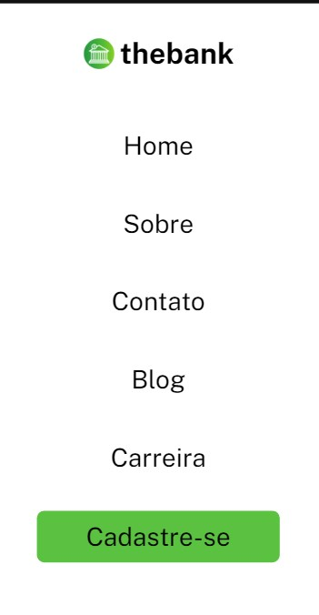

# Projeto com  README


Um projeto de flexbox onde foi criado um menu
com titulo e logo responsivos para dispositivos mobile.



## Tecnologias utilizadas

- HTML     
- CSS   


## Como utilizar

1-clone para o projeto
```
git clone <url>
```

2-Acesse a pasta do projeto
```
cd repositorio-com-readme
```

3-Utilize para ter uma base quando for criar seu 
propio menu de navegação para sites futuros.


